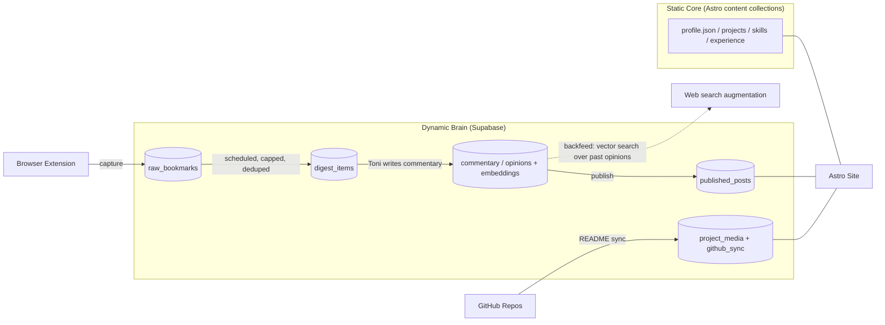

# Portfolio Platform — Product Requirements Document
**Owner:** Toni Esan · **Doc purpose:** Hand-off to Claude Code for build · **Status:** v1 draft

---

## 1. Overview

This isn't a CV microsite. It's a personal platform with three connected systems:

1. **Core Portfolio** — projects, skills, experience, identity. Already partially specced via an existing JSON source-of-truth and a single-file HTML site.
2. **Cool News Pipeline** — a personal "brain" fed by X/Twitter bookmarks, where Toni adds his own commentary, which gets published as a blog, and feeds back into the system so future drafting and research reflect his actual opinions.
3. **Project Expansion Pipeline** — turns a GitHub repo + Toni's own reasoning into a fully fleshed-out, media-rich project page, with auto-suggested discipline ("hat") tags and content repurposable for social (TikTok etc.).

All three share one principle: **Toni provides sparse input, the system does the heavy lifting, and the output stays cross-linked** — projects ↔ skills ↔ blog posts ↔ disciplines — exactly like the existing skill-cluster/project graph already does.

This document is written so it can be handed directly to Claude Code as a build brief.

---

## 2. Current State (what already exists)

- A single-file HTML portfolio site, rendering from a hand-authored JSON file (`toni_esan_portfolio_unfin.json`).
- That JSON already defines: `meta`, `education`, `skill_clusters` (id/label/icon/skills/related_project_ids), `projects` (id/title/status/category/role/period/descriptions/key_contributions/skills_used/tech_tags/metrics), `experience`, `interests_and_identity`, `design_guidance`, and a `prompt_for_site_generation` block.
- Visual identity: dark-mode-first, hydrangea/halftone motif, DM Serif Display (display), Syne (UI/headers), DM Mono (tags/meta text), animated SVG hero, filterable project grid, modal project detail views.
- Status taxonomy already exists: `shipped` / `in_progress` / `idea` ("In the Lab").
- A large backlog of **unprocessed project ideas** sits in raw doc form (e.g. `new_cv_aid.docx`) — numbered concepts (RAG learning apps, IoT knock-to-light, Spotify/fitness mashups, etc.) that never made it into structured `projects[]` entries. The intake pipeline in §6 exists partly *because* this backlog exists.

**Implication:** the core data model doesn't need to be invented — it needs to be *extended* to support media, GitHub linkage, and reasoning/Q&A fields, and the site needs to grow from "renders one static JSON" into "renders a static core + two live content pipelines."

---

## 3. Recommended Architecture

You said "not sure — recommend the best fit," then added a second constraint that changes the call: you'll be redesigning the frontend frequently and want strong Three.js support. That points to React for the interactive layer, not Vue — **React Three Fiber** (R3F) + **drei** is the most mature declarative Three.js ecosystem of any framework by a wide margin, with far more actively-maintained components, examples, and post-processing/animation add-ons than Vue's Three.js wrappers. For a site where 3D and visual experimentation *is* the point, that ecosystem depth matters more than which framework you already know.

| Layer | Choice | Why |
|---|---|---|
| **Site framework** | **Astro**, with **React** components for interactive islands (skill-graph, filters, media galleries, 3D scenes) | Astro's content collections are a near-perfect match for "projects ↔ skills ↔ posts" relational content — closer to your existing JSON-as-source-of-truth instinct than a pure SPA. It ships zero JS by default (good for a job-search-facing site that needs to be fast), and crucially, **the content/data layer stays fully decoupled from presentation** — you can redesign the visual layer as often as you want without ever touching how projects/skills/posts are modeled or linked. |
| **3D / heavy visual layer** | **React Three Fiber + drei**, mounted as an Astro island | Largest, most current ecosystem for declarative Three.js — components for post-processing, physics, camera controls, etc. are maintained far more actively here than in any other framework's Three.js bindings, which matters if 3D becomes a recurring part of the redesigns. |
| **Dynamic data / "the brain"** | **Supabase** (Postgres + Storage + `pgvector`) | Already in your stack. Stores bookmarks, digests, your commentary/opinions (with embeddings for backfeed), published posts, and project media — all the stuff that changes on its own schedule rather than by hand. |
| **Scheduled jobs** (digest building, GitHub sync) | **Vercel Cron Jobs** triggering serverless functions, with a small **Railway** worker for anything long-running | Vercel Cron is free/simple for "run this function daily." Railway is your fallback for jobs that need more time/memory than a serverless function allows. |
| **Bookmark capture** | **Browser extension** (see §6.1) | You picked this. It's also the lower-risk option vs. a server-side bot holding your X session — see Risk Log (§10). |
| **Hosting** | **Vercel** | You already deploy here; Astro + Vercel is first-class. |

**Net effect:** the *static* identity/projects/skills/experience content keeps behaving like your current JSON (still hand-editable, still the thing you could in principle hand to Gemini). The *dynamic* pipelines (blog, bookmark digesting) live in Supabase because they need querying, dedup, and timestamps that a flat JSON file can't do gracefully.



---

## 4. Extended Data Model

### 4.1 Core profile (extends existing JSON / becomes content collections)
No breaking changes — additive fields only:

```ts
// projects[] — new optional fields
github_repo_url?: string
media?: { type: "image"|"video"; url: string; caption?: string }[]
my_reasoning?: string          // "why I built this" — Toni's own words, Q&A-derived
qna_log?: { question: string; answer: string }[]
content_repurpose_flags?: { tiktok?: boolean; linkedin?: boolean; notes?: string }
related_post_ids?: string[]    // links to blog posts that inspired or discuss this project
last_synced_from_github?: string // ISO date
```

### 4.2 Blog / Cool News pipeline (Supabase tables)

| Table | Key columns | Purpose |
|---|---|---|
| `raw_bookmarks` | id, url, author, captured_text, captured_at, status (`new`/`in_digest`/`archived`) | Exact-as-captured items from the extension. Never edited. |
| `digest_items` | id, bookmark_id, cluster_id, one_line_summary, surfaced_at | Deduped/clustered/capped view Toni actually reviews. |
| `commentary` | id, digest_item_id (nullable — can be freeform), body, embedding (`vector`), created_at, topic_tags[] | Toni's own words on a topic. **This is the backfeed corpus.** |
| `published_posts` | id, slug, title, body_md, source_urls[], related_project_ids[], related_skill_cluster_ids[], published_at | Final public blog post. |

### 4.3 Project enrichment (Supabase, supplements the static JSON at build time)

| Table | Key columns | Purpose |
|---|---|---|
| `github_sync_cache` | repo_full_name, readme_md, description, topics[], last_commit_at | Raw pull from GitHub API. |
| `project_qna_sessions` | project_id, question, answer, answered_at | Stores the intake conversation (see §7.2). |
| `project_media` | project_id, storage_path, type, caption, sort_order | Screenshots/video, stored in Supabase Storage. |

**Cross-linking rule (carried over from the existing design philosophy):** every entity that *can* reference another (`skills_used`, `related_project_ids`, `related_post_ids`, `topic_tags`) should, so the site's interactive skill-graph extends naturally to include blog posts — clicking "Computer Vision" should surface matching projects *and* matching posts.

---

## 5. Feature Spec — Core Portfolio Site

Carries forward the existing `design_guidance` block almost as-is, plus:

- **Project detail pages** (not just modals) get a dedicated route per project — needed once there's real media and a "build log." Modal-on-grid stays for quick browsing; deep-link to a full page for anything with media or a GitHub link.
- **Media gallery** per project: image/video grid, lightbox, optional "this clip works for TikTok" badge (pulled from `content_repurpose_flags`).
- **Build log / status trail**: a few timestamped lines per project (auto-populated from GitHub commits where available, manually added otherwise) — turns "idea → shipped" into a visible story instead of a static badge.
- **Skill graph**: keep the existing interactive-node concept, but extend the relation set to include blog posts, not just projects.
- **Blog index + post template**: typography-led (DM Serif Display for headers, body text sized for long-form reading), each post footer auto-rendering `source_urls` as credited links and `related_project_ids` as "this came from / led to" chips.

---

## 6. Feature Spec — Cool News → Blog Pipeline

### 6.1 Capture (Browser Extension — fork of `xarchive`)
- **Base tool: [xarchive](https://github.com/sytelus/xarchive)** (MIT, open source, zero dependencies) rather than building a scraper from scratch. It already solves the hard part: reads X's internal GraphQL API to export your full bookmark collection with folder assignments — including X Premium folders — with no item cap, conservative rate-limiting, and pause/resume. Auth is captured passively from your normal browsing session and never leaves the extension.
- **Two real constraints to design around, not blockers:**
  1. **It exports everything, tagged by folder — not "just cool news."** xarchive pulls your whole bookmark collection in one run and labels each item with its folder. The fork adds a filter step (`folder === "cool news"`) *after* export, before anything reaches Supabase — trivial to add, just not something X's API does for you.
  2. **It's a manual click, not a background cron.** "Start Export" is a button you press while on x.com — there's no way to pull bookmarks without an active, logged-in browser context. So "scheduled" (§6.2) applies to the *digest processing* step, not capture itself — you'll still click export periodically (~30s for most collections), and automation picks up from there.
- **Fork changes needed:** after export + folder-filter, instead of (or alongside) the local JSON download, POST new items (URL, author, tweet text, timestamp, folder) to a Supabase Edge Function → `raw_bookmarks`, deduped on URL.
- No server ever holds your X session — capture only happens while *you're* browsing, which keeps this firmly in "personal tool" territory rather than unattended scraping (see Risk Log).
- **Maintenance note:** xarchive reverse-engineers X's internal GraphQL query IDs, which rotate every 2–4 weeks (it has a fallback, but occasionally needs a `git pull` + extension reload). Not a blocker, just don't expect "install once, never touch again."

### 6.2 Digest (Scheduled — your chosen cadence)
- A Vercel Cron job (daily or weekly — recommend **weekly** to start, since "cool news" is rarely urgent) runs against `raw_bookmarks` where `status = 'new'`:
  1. Cluster similar items (embedding similarity) so five tweets about the same launch become one digest item.
  2. Cap the digest at **N items** (recommend 5–8) ranked by relevance to your stated interest areas (AI/CV, automation, AR/spatial, EVs, fitness tech — pulled straight from `interests_and_identity.headline_interests`).
  3. Write one-line LLM summaries into `digest_items`.
- This is the **anti-overload** mechanism you asked for — you only ever see a short, curated list, never the raw firehose.

### 6.3 Commentary (you, in your own words)
- A simple authenticated page (just for you) lists current `digest_items`. For each, you write your take — that's it, that's the writing step.
- Saved to `commentary` with a generated embedding.

### 6.4 Backfeed + Research Augmentation
- Every new `commentary` row is embedded and stored — this *is* the brain remembering your opinions.
- When drafting a post (or when you ask the assistant to "find more on this"), the system does a vector search over `commentary` first (so your past stance on a topic isn't re-derived from scratch), then optionally runs a live web search for fresh context, and presents both to you before you finalize a post.

### 6.5 Publish
- Turning a `commentary` row into a `published_posts` row is a manual action (a button), never automatic — you stay the editor of record.
- Source URLs are always credited and linked; per copyright practice, only short paraphrase/summary of source articles, never reproduced text.

### 6.6 Optional Phase 2 — Obsidian mirror
- If you want a local, linkable "second brain" view of the same data, a small script can export `commentary` + `digest_items` to Markdown files in an Obsidian vault (one-way sync, Supabase → Obsidian). Not required for MVP — the Supabase tables already function as the brain; Obsidian would just be a nicer *reading* surface for you personally.

---

## 7. Feature Spec — Project Expansion Pipeline

### 7.1 GitHub Sync
- Weekly scheduled job (or manually triggered via a CLI command you run after shipping something) pulls README, description, topics, and last-commit date for any repo you've tagged for inclusion (simplest approach: a `portfolio` topic/label on the GitHub repo itself, or a manifest list).
- Cached in `github_sync_cache`; diffed against the existing project record so you only get asked about *new or changed* repos, not the same one every week.

### 7.2 Q&A Intake
- For a new/changed repo, the system generates a short, specific question set (not generic) — e.g. *"What problem were you actually trying to solve with this one?" / "What would you do differently now?" / "Is this shipped, in progress, or shelved?"*
- Matches your existing workflow: you give sparse, informal answers; the system expands them into the polished `long_description` / `my_reasoning` fields. This can happen either in a normal Claude chat (writes back via API) or via a lightweight admin form for when you're not in a chat session.

### 7.3 Hat / Discipline Tagging
- Auto-suggest `skills_used` and `category` by matching README/description keywords against your existing `skill_clusters[].skills` — e.g. "YOLO" → `computer_vision`, "Vue" → `web_software`.
- Always shown as a **suggestion you confirm or override**, never auto-applied silently — your existing clusters are already well-curated and shouldn't drift from keyword-matching noise.

### 7.4 Media + Content Repurposing
- Screenshots/video go to Supabase Storage, linked via `project_media`.
- Each project gets a `content_repurpose_flags` field — a simple checklist (TikTok-worthy? LinkedIn-worthy?) plus a free-text note, so when you're in content-creation mode you can filter "what's ready to clip" without re-reading every project.

---

## 8. Non-Functional Requirements

- **Single-admin auth**: pipeline review pages (digest review, Q&A intake) sit behind Supabase Auth (magic link is enough — you're the only user).
- **Performance**: Astro's zero-JS-by-default approach should keep Lighthouse scores high — this matters for a site doing double duty as a job-search asset.
- **Accessibility**: dark-mode-first is fine, but verify contrast ratios on the hydrangea/halftone imagery against text overlays (WCAG AA minimum).
- **Mobile-first**: assume a meaningful share of recruiter/portfolio traffic is on mobile.
- **SEO on the blog**: since the blog doubles as personal-brand content, posts need proper meta tags / OG images — useful both for job search and for repurposing into social.

---

## 9. Phased Build Order (for Claude Code)

| Phase | Scope |
|---|---|
| **0 — Parity rebuild** | Port existing JSON into Astro content collections. Ship visual parity with the current single-file site (hero, grid, modal, skill clusters) before adding anything new. |
| **1 — Brain foundations** | Supabase schema for `raw_bookmarks` / `digest_items` / `commentary`. Browser extension MVP (capture only). Authenticated review page (read digest, write commentary — no scheduling yet, manual trigger is fine). |
| **2 — Pipeline automation** | Vercel Cron for digest building (clustering, capping, summarizing). Embedding-based backfeed search. Publish flow → `published_posts` → blog index/post pages on the site. |
| **3 — Project pipeline** | GitHub sync job, Q&A intake flow, hat auto-suggestion, media upload + gallery on project detail pages. |
| **4 — Polish / nice-to-haves** | Content-repurposing flags + caption helpers, build-log auto-population from commits, optional Obsidian mirror. |

---

## 10. Assumptions & Risk Log

- **X ToS risk**: automated scraping of X data technically sits outside X's terms. Keeping capture *client-side and triggered by your own browsing* (rather than a server holding your session) is the lower-risk version of this — flagged here so it's a conscious choice, not an oversight.
- **Cadence default**: weekly digest assumed as a sane starting point; trivially changed to daily later if the bookmark folder fills up faster than expected.
- **GitHub sync trigger**: assumed repo-tagging (topic or manifest) rather than syncing *every* repo in your account, to avoid pulling in throwaway/private repos.
- **Auth**: assumed Supabase magic-link auth is sufficient since you're the sole admin user; revisit if you ever want collaborators.
- **Astro + React choice**: switched from an earlier Vue-islands recommendation once you flagged frequent aesthetic redesigns + Three.js as priorities — React Three Fiber's ecosystem depth is the deciding factor, not prior familiarity. Astro itself is framework-agnostic, so this is purely about which islands to write in.
- **xarchive dependency**: relies on a third-party open-source extension reverse-engineering X's internal API. Low risk (MIT license, active enough, you can fork and maintain your own copy), but worth knowing it's not an official/stable API contract — if X changes its GraphQL schema significantly, the fork may need a patch.

---

## 11. Appendix — Existing JSON Schema Reference (for Claude Code)

Top-level keys already present in `toni_esan_portfolio_unfin.json`, to be preserved/extended rather than replaced:

`meta`, `education[]`, `skill_clusters[]` (id, label, icon_suggestion, skills[], related_project_ids[]), `projects[]` (id, title, status, featured, category[], role, period, short_description, long_description, key_contributions[], skills_used[], tech_tags[], metrics[]), `experience[]`, `interests_and_identity`, `design_guidance`, `prompt_for_site_generation`.
